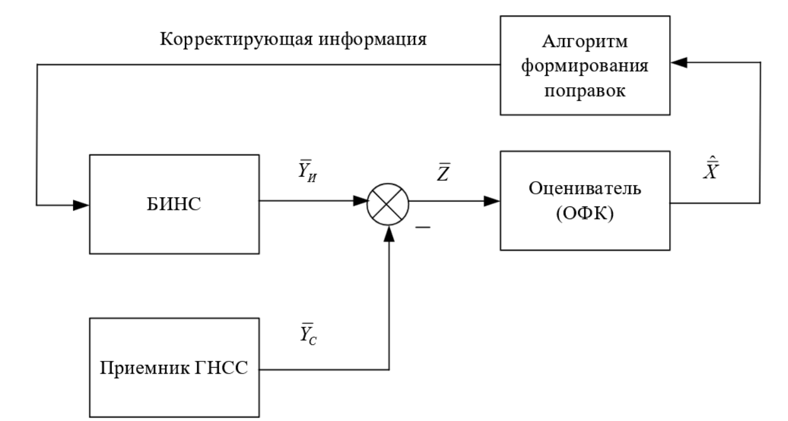

Основной навигационной системой многих современных роботизированных объектов (самолеты, беспилотные воздушные аппараты, подводные аппараты различных классов, беспилотный автомобильный транспорт и так далее) по причине высокой степени надёжности и автономности является бесплатформенная инерциальная навигационная система (БИНС). Как известно, основным недостатком БИНС является быстрое накопление ошибок, поэтому БИНС требует периодической или постоянной корректировки (исключение - объекты с коротким сроком активной эксплуатации).

Смысл построения комплексных навигационных систем заключается в объединении датчиков и систем, основанных на различных физических принципах работы, что позволяет производить оценку и корректировку погрешностей отдельных систем. К настоящему времени сложились «традиционные» принципы построения таких комплексных систем. Эти принципы можно выразить в следующих тезисах:
1. БИНС является «ядром» комплексной навигационной системы, а все остальные навигационные датчики и системы применяются для коррекции БИНС;
2. Основным корректором БИНС является приемник ГНСС, за исключением объектов, для которых использование спутниковых систем невозможно или затруднительно (роботы, работающие в помещениях; подводные роботы; космические системы и так далее).
3. Для оценки погрешностей БИНС используется алгоритм оптимального фильтра Калмана (ОФК), его модификации или схожие алгоритмы.

Рассмотрим пример относительно простой структурной схемы алгоритма комплексной обработки информации на основе ОФК (рисунок 1).

На рисунке 1 приняты следующие обозначения:

$\overline{Y_{И}}$ - вектор выходных параметров БИНС (координаты, проекции путевой скорости, углы ориентации и так далее); $\overline{Y_{С}}$ - вектор выходных параметров приемника ГНСС; $\overline{Z}$ - вектор разности выходных параметров систем или вектор измерений; $\widehat{X}$ - вектор оценки искомых параметров или оценка вектора состояния системы.

Параметры, входящие в вектор $\overline{X}$ определяются принятой моделью погрешностей БИНС (моделью системы).

При построении вектора $\overline{Z}$ могут использоваться не все параметры, входящие в векторы $\overline{Y_{И}}$ и $\overline{Y_{С}}$. Для определения минимальной размерности вектора $\overline{Z}$ требуется произвести анализ наблюдаемости проектируемого алгоритма.

---

## Модель системы

Для оценки погрешностей БИНС предлагается использовать «традиционную» модель погрешностей БИНС вида:

$$
\dot{\overline{X}} = F \cdot \overline{X} + B \cdot \overline{U} + G \cdot \overline{W} \tag{1}
$$

где $F$ - матрица динамики системы; $\overline{X}$ - вектор состояния системы; $B$ - матрица управления; $\overline{U}$ - вектор управляющих сигналов; $G$ - матрица связи шумов системы; $\overline{W}$ - вектор шумов системы.

Инструментальные ошибки датчиков угловых скоростей (ДУС) и акселерометров можно описать соотношениями вида:

$$
\delta\Omega = \Delta\Omega + \Delta K_{\Omega} \cdot \Omega + \delta\Omega^{б.ш.}
$$

$$
\delta n = \Delta n + \Delta K_{n} \cdot n + \delta n^{б.ш.} \tag{2}
$$

где $\delta\Omega$ - погрешность определения проекции абсолютной угловой скорости вращения на измерительную ось ДУС; $\Delta\Omega$ - постоянная составляющая погрешности ДУС (сдвиг нуля); $\Delta K_{\Omega}$ - ошибка масштабного коэффициента ДУС (в предлагаемой модели не учитывается); $\Omega$ - идеальное значение проекции абсолютной угловой скорости вращения на измерительную ось ДУС; $\delta\Omega^{б.ш.}$ - шумовая составляющая погрешности гироскопов, описываемая случайным гауссовским процессом типа "белого шума" с нулевым средним и известной интенсивностью; $\delta n$ - погрешность определения проекции кажущегося ускорения; $\Delta n$ - постоянная составляющая погрешности акселерометра (сдвиг нуля); $\Delta K_{n}$ - ошибка масштабного коэффициента акселерометра (в предлагаемой модели не учитывается); $n$ - идеальное значение проекции кажущегося ускорения на измерительную ось акселерометра; $\delta n^{б.ш.}$ - шумовая составляющая погрешности акселерометра, описываемая случайным гауссовским процессом типа "белого шума" с нулевым средним и известной интенсивностью.

Пусть вектор состояния системы имеет следующий вид:

$$
\overline{X}^{T} = \begin{bmatrix} x_{1}, & x_{2}, & x_{3}, & x_{4}, & \alpha, & \beta, & \gamma, & \Delta\Omega_{X}, & \Delta\Omega_{Y}, & \Delta\Omega_{Z}, & \Delta n_{X}, & \Delta n_{Y}, & \Delta n_{Z} \end{bmatrix}
$$

где $\Delta\Omega_{X}, \Delta\Omega_{Y}, \Delta\Omega_{Z}$ - проекции постоянных составляющих погрешностей ДУС на оси связанной СК (в предположении, что строительные оси БИНС и объекта совпадают); $\Delta n_{X}, \Delta n_{Y}, \Delta n_{Z}$ - постоянные составляющие ошибок акселерометров в проекции на оси связанной СК; $x_{1}, x_{2}$ - ошибки определения координат БИНС, связанные с ошибками определения долготы $\delta\lambda$ и широты $\delta\varphi$, соответственно:

$$
x_{1} = \delta\lambda \cdot \rho_{2} \cdot \cos(\varphi)
$$

$$
x_{2} = \delta\varphi \cdot \rho_{1} \tag{3}
$$

где $\varphi$ - истинное значение текущей широты; $\rho_{1}, \rho_{2}$ - радиусы кривизны, соответственно, меридионального и перпендикулярного ему сечений, которые могут быть вычислены как:

$$
\rho_{1} = \frac{a \cdot (1 - e^{2})}{\sqrt{(1 - e^{2} \cdot \sin^{2}(\varphi))^{3}}} + h
$$

$$
\rho_{2} = \frac{a}{\sqrt{1 - e^{2} \cdot \sin^{2}(\varphi)}} + h \tag{4}
$$

где $a$ - длина большой полуоси земного эллипсоида; $e$ - эксцентриситет земного эллипсоида, оба параметра определяются принятой моделью Земли; $h$ - истинное значение текущей высоты над эллипсоидом; $x_{3}, x_{4}$ - ошибки в определении скорости изменения координат БИНС, связанные с ошибками определения восточной $\delta V_{E}$ и северной $\delta V_{N}$ составляющими путевой скорости (проекции путевой скорости на оси нормальной СК):

$$
x_{3} = \delta V_{E} + \left( \frac{V_{h}}{\rho_{2}} + \Omega_{E} \cdot \mathrm{tg}(\varphi) \right) \cdot x_{1} + \Omega_{H} \cdot x_{2}
$$

$$
x_{4} = \delta V_{N} + \frac{V_{h}}{\rho_{1}} \cdot x_{1} \tag{5}
$$

где $V_{h}$ - истинное значение вертикальной составляющей путевой скорости; $\Omega_{E}, \Omega_{N}, \Omega_{H}$ - истинные проекции абсолютной угловой скорости вращения объекта на оси нормальной СК.

$\alpha, \beta, \gamma$ - погрешности ориентации, обусловленные дрейфами ДУС. При этом:

$$
\alpha_{1} = -\frac{x_{2}}{\rho_{1}}, \quad \beta_{1} = \frac{x_{1}}{\rho_{2}}, \quad \gamma_{1} = \frac{x_{1}}{\rho_{2}} \cdot \mathrm{tg}(\varphi)
$$

$$
\alpha_{2} = \alpha + \alpha_{1}, \quad \beta_{2} = \beta + \beta_{1}, \quad \gamma_{2} = \gamma + \gamma_{1} \tag{6}
$$

где $\alpha_{1}$, $\beta_{1}$, $\gamma_{1}$ - погрешности ориентации вычисленного трехгранника относительно базового за счет наличия ошибок определения координат объекта; $\alpha_{2}$, $\beta_{2}$, $\gamma_{2}$ - ошибки ориентации вычисленного БИНС трехгранника относительно базового.

Связь приведенных выше ошибок ориентации БИНС и ошибок БИНС в определении углов крена, рысканья и тангажа для траектории общего вида примет вид:

$$
\begin{bmatrix} \delta\psi \\ \delta\upsilon \\ \delta\gamma \end{bmatrix} = 
\begin{bmatrix} 
\sin\psi\tan\upsilon & \cos\psi\tan\upsilon & -1 \\ 
\cos\psi & -\sin\psi & 0 \\ 
\sin\psi/\cos\upsilon & \cos\psi/\cos\upsilon & 0 
\end{bmatrix} 
\cdot 
\begin{bmatrix} \alpha_{2} \\ \beta_{2} \\ \gamma_{2} \end{bmatrix} \tag{7}
$$

где $\psi, \upsilon, \gamma$ - идеальные значения текущих углов рысканья, тангажа и крена; $\delta\psi, \delta\upsilon, \delta\gamma$ - погрешности определения соответствующих углов.

Для приведенного вектора состояния системы матрица динамики примет следующий вид:

$$
F_{13 \times 13} = 
\begin{bmatrix} 
0 & 0 & 1 & 0 & 0 & 0 & 0 & 0 & 0 & 0 & 0 & 0 & 0 \\ 
0 & 0 & 0 & 1 & 0 & 0 & 0 & 0 & 0 & 0 & 0 & 0 & 0 \\ 
-\omega_{0}^{2} & 0 & 0 & 0 & 0 & n_{H} & 0 & C_{1,1} & C_{1,2} & C_{1,3} & 0 & 0 & 0 \\ 
0 & -\omega_{0}^{2} & 0 & 0 & -n_{H} & 0 & n_{E} & C_{2,1} & C_{2,2} & C_{2,3} & 0 & 0 & 0 \\ 
0 & 0 & 0 & 0 & 0 & 0 & 0 & C_{1,1} & C_{1,2} & C_{1,3} & 0 & 0 & 0 \\ 
0 & 0 & 0 & 0 & 0 & 0 & 0 & C_{2,1} & C_{2,2} & C_{2,3} & 0 & 0 & 0 \\ 
0 & 0 & 0 & 0 & 0 & 0 & 0 & C_{3,1} & C_{3,2} & C_{3,3} & 0 & 0 & 0 \\ 
0 & 0 & 0 & 0 & 0 & 0 & 0 & 0 & 0 & 0 & 0 & 0 & 0 \\ 
0 & 0 & 0 & 0 & 0 & 0 & 0 & 0 & 0 & 0 & 0 & 0 & 0 \\ 
0 & 0 & 0 & 0 & 0 & 0 & 0 & 0 & 0 & 0 & 0 & 0 & 0 \\ 
0 & 0 & 0 & 0 & 0 & 0 & 0 & 0 & 0 & 0 & 0 & 0 & 0 \\ 
0 & 0 & 0 & 0 & 0 & 0 & 0 & 0 & 0 & 0 & 0 & 0 & 0 \\ 
0 & 0 & 0 & 0 & 0 & 0 & 0 & 0 & 0 & 0 & 0 & 0 & 0 
\end{bmatrix}
$$

где $\omega_{0}$ - частота шулеровских колебаний; $n_{E}, n_{N}, n_{H}$ - проекции кажущегося ускорения на оси нормальной СК; $C$ - матрица пересчета из связанной в нормальную СК.

Для формирования проекций $n_{E}, n_{N}, n_{H}$ следует перевести идеализированные показания акселерометров в нормальную СК при помощи матрицы $C$.

Вектор шумов инерциальных датчиков для модели (1) будет иметь вид:

$$
\overline{W}^{T} = \begin{bmatrix} \delta\Omega_{X}^{б.ш.}, & \delta\Omega_{Y}^{б.ш.}, & \delta\Omega_{Z}^{б.ш.}, & \delta n_{X}^{б.ш.}, & \delta n_{Y}^{б.ш.}, & \delta n_{Z}^{б.ш.} \end{bmatrix} \tag{8}
$$

где $\delta\Omega_{X}^{б.ш.}, \delta\Omega_{Y}^{б.ш.}, \delta\Omega_{Z}^{б.ш.}$ - шумовые составляющие погрешностей ДУС в проекции на оси связанной СК; $\delta n_{X}^{б.ш.}, \delta n_{Y}^{б.ш.}, \delta n_{Z}^{б.ш.}$ - погрешности акселерометров в виде несмещенного гауссовского случайного процесса типа "белого шума" в проекции на оси связанной СК.

Матрица шумов системы будет иметь вид:

$$
G_{13 \times 6} = 
\begin{bmatrix} 
0 & 0 & 0 & 0 & 0 & 0 \\ 
0 & 0 & 0 & 0 & 0 & 0 \\ 
0 & 0 & 0 & C_{1,1} & C_{1,2} & C_{1,3} \\ 
0 & 0 & 0 & C_{2,1} & C_{2,2} & C_{2,3} \\ 
C_{1,1} & C_{1,2} & C_{1,3} & 0 & 0 & 0 \\ 
C_{2,1} & C_{2,2} & C_{2,3} & 0 & 0 & 0 \\ 
C_{3,1} & C_{3,2} & C_{3,3} & 0 & 0 & 0 \\ 
0 & 0 & 0 & 0 & 0 & 0 \\ 
0 & 0 & 0 & 0 & 0 & 0 \\ 
0 & 0 & 0 & 0 & 0 & 0 \\ 
0 & 0 & 0 & 0 & 0 & 0 \\ 
0 & 0 & 0 & 0 & 0 & 0 \\ 
0 & 0 & 0 & 0 & 0 & 0 
\end{bmatrix} \tag{9}
$$

Влияние управляющих сигналов в предлагаемой модели не учитывается, то есть полагаем, что $B \cdot \overline{U}$ - нулевой вектор.

---

## Модель измерений

Модель измерений имеет вид:

$$
\overline{Z} = H \cdot \overline{X} + \overline{V}
$$

где $\overline{Z}$ - вектор измерений; $H$ - матрица связи вектора состояния и вектора измерений; $\overline{V}$ - вектор шумов измерений.

В качестве входной информации для ОФК необходимо смоделировать «реальные измерения». Для принятой нами структурной схемы алгоритмов комплексной обработки информации «реальный» вектор измерений представляет собой разницу между показаниями БИНС и приемника ГНСС. Для режима позиционно-скоростной коррекции:

$$
\overline{Z} = \overline{Y_{И}} - \overline{Y_{С}} = 
\begin{bmatrix} \lambda^{И} \\ \varphi^{И} \\ V_{E}^{И} \\ V_{N}^{И} \end{bmatrix} - 
\begin{bmatrix} \lambda^{С} \\ \varphi^{С} \\ V_{E}^{С} \\ V_{N}^{С} \end{bmatrix}
$$

Тогда с учетом выражений (3, 5) матрица H примет вид:

$$
H_{4 \times 13} = 
\begin{bmatrix} 
\frac{1}{\rho_{2}\cos\varphi} & 0 & 0 & 0 & 0 & 0 & 0 & 0 & 0 & 0 & 0 & 0 & 0 \\ 
0 & \frac{1}{\rho_{1}} & 0 & 0 & 0 & 0 & 0 & 0 & 0 & 0 & 0 & 0 & 0 \\ 
-(\frac{V_{h}}{\rho_{2}} + \Omega_{E}\mathrm{tg}\varphi) & -\Omega_{H} & 1 & 0 & 0 & 0 & 0 & 0 & 0 & 0 & 0 & 0 & 0 \\ 
-\frac{V_{h}}{\rho_{1}} & 0 & 0 & 1 & 0 & 0 & 0 & 0 & 0 & 0 & 0 & 0 & 0 
\end{bmatrix}
$$

$\overline{V}$ содержит шумы соответствующих измерений ГНСС и задается согласно условиям задачи.

---

## Алгоритм ОФК

Уравнения ОФК имеют вид:

$$
\dot{\widehat{X}} = F \cdot \widehat{X} + B \cdot \overline{U} + K \cdot (\overline{Z} - H \cdot \widehat{X})
$$

$$
K = P \cdot H^{T} \cdot R^{-1}
$$

$$
\dot{P} = F \cdot P + P \cdot F^{T} + G \cdot Q \cdot G^{T} - P \cdot H^{T} \cdot R^{-1} \cdot H \cdot P
$$

где $\widehat{X}$ - оценка вектора состояния системы; $K$ - матрица коэффициентов усиления Калмана; $P$ - ковариационная матрица; $R$ - матрица интенсивности шумов измерений; $Q$ - матрица интенсивности шумов системы.

$R$ - диагональная матрица размерности $\overline{V}$, её диагональные элементы могут быть заданы как:

$$
R_{V_{i \times i}} \cong \frac{\sigma_{V_{i}}^{2}}{\Delta\tau}
$$

$Q$ - диагональная матрица размерности $\overline{W}$, её диагональные элементы могут быть заданы как:

$$
Q_{W_{i \times i}} \cong \frac{\sigma_{W_{i}}^{2}}{\Delta\tau}
$$

$\Delta\tau$ - разность между текущим и предыдущим моментами времени.

При переходе к дискретному виду ОФК представляется в виде:

$$
\widehat{X}_{k} = \Phi_{k/k-1} \cdot \widehat{X}_{k-1} + B_{k/k-1} \cdot \overline{U}_{k-1} + K_{k} \cdot (\overline{Z}_{k} - H_{k} \cdot \Phi_{k/k-1} \cdot \widehat{X}_{k-1})
$$

$$
K_{k} = S_{k} \cdot H_{k}^{T} \cdot (H_{k} \cdot S_{k} \cdot H_{k}^{T} + R_{k})^{-1}
$$

$$
S_{k} = \Phi_{k/k-1} \cdot P_{k-1} \cdot \Phi_{k/k-1}^{T} + \Gamma_{k/k-1} \cdot Q_{k-1} \cdot \Gamma_{k/k-1}^{T}
$$

$$
P_{k} = (E - K_{k} \cdot H_{k}) \cdot S_{k}
$$

где $S$, $P$ - априорная и апостериорная ковариационные матрицы соответственно; $E$ - единичная матрица.

Переход к дискретному виду осуществляется при использовании следующих соотношений:

$$
R(T) = \frac{R}{T}, \quad Q(T) = \frac{Q}{T}
$$

$$
\Phi(T) = e^{FT} = E + F \cdot T + \frac{(F \cdot T)^{2}}{2} + \ldots = \sum_{i=0}^{\infty} \frac{(F \cdot T)^{i}}{i!}
$$

$$
\Gamma(T) = F^{-1} \cdot (\Phi(T) - E) \cdot G = \left\{ \sum_{i=0}^{\infty} \frac{(F \cdot T)^{i}}{(i+1)!} \right\} \cdot G \cdot T
$$

где $T$ - шаг дискретизации.

Для решения задачи достаточно принять, что:

$$
\Phi(T) = E + F \cdot T
$$

$$
\Gamma(T) = G \cdot T
$$

При этом на статистические характеристики шумов системы, шумов измерений и начальное значение вектора состояния накладываются следующие ограничения:

1. $\overline{W}(t), \overline{V}(t)$ - случайный гауссов процесс типа белого шума, несмещенный, с известными корреляционными матрицами вида:

$$
M\left[ \overline{W}(t), \overline{W}(t)^{T} \right] = \left[ Q_{W}(t) \right] \cdot \delta(t - \tau)
$$

$$
M\left[ \overline{V}(t), \overline{V}(t)^{T} \right] = \left[ R_{V}(t) \right] \cdot \delta(t - \tau)
$$

где $\delta(t - \tau)$ - дельта-функция Дирака.

2. Шумы системы, шумы измерений и начальное значение вектора состояния не коррелированы:

$$
M\left[ \overline{V}(t), \overline{W}(t)^{T} \right] = 0; \quad M\left[ \overline{X}(t_{0}), \overline{W}(t)^{T} \right] = 0; \quad M\left[ \overline{X}(t_{0}), \overline{V}(t)^{T} \right] = 0
$$

3. Вводится начальное значение $M\left[ \overline{X}(t_{0}) \right] = \overline{m}_{X}$ и

$$
M\left[ (\overline{X}(t_{0}) - \overline{m}_{X}), (\overline{X}(t_{0}) - \overline{m}_{X})^{T} \right] = \left[ P_{0} \right]
$$

При условии выполнения наложенных ограничений ОФК строит оптимальную оценку вектора состояния на основе минимизации квадратичного критерия:

$$
\begin{aligned} J &= M\left[ (\overline{X}(t) - \widehat{X}(t))(\overline{X}(t) - \widehat{X}(t))^{T} \right] \\ &= M\left[ \mathrm{Tr}{ \overline{e}(t) \cdot \overline{e}(t)^{T} } \right] \\ &= \mathrm{Tr}(P(t)) \\ &= \sum_{i=1}^{n} \sigma_{i,i}^{2} \end{aligned}
$$

где $n = \dim(\overline{X})$, $\sigma_{i,i}$ - СКО соответствующего элемента вектора ошибок оценок $\overline{e}(t)$.